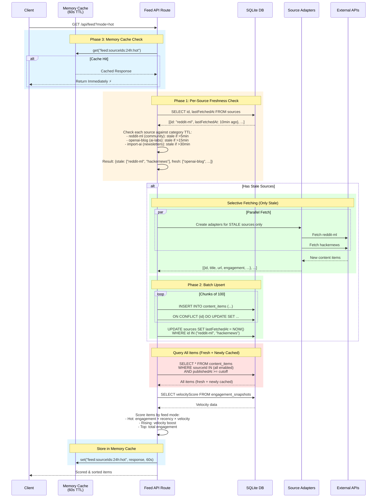
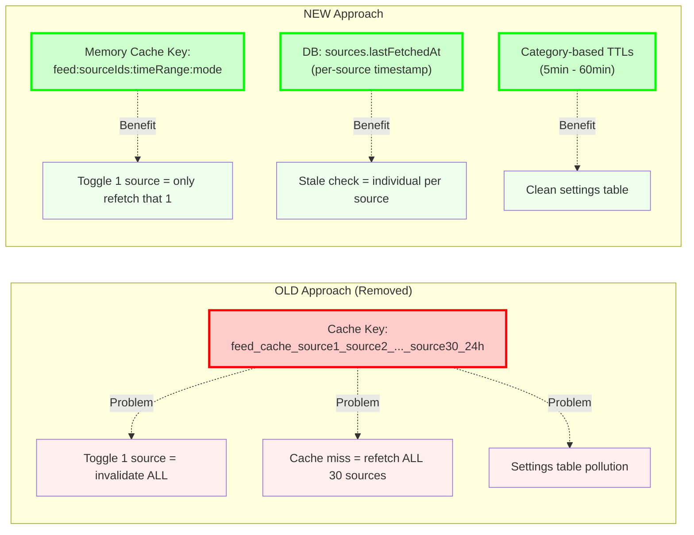
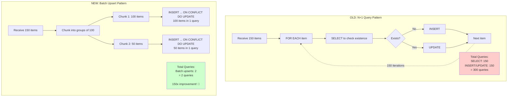
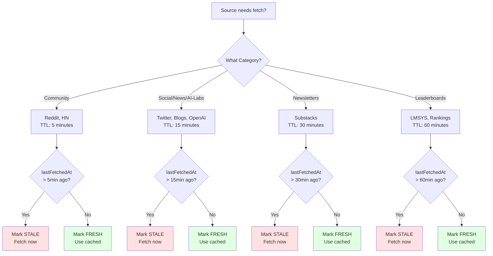
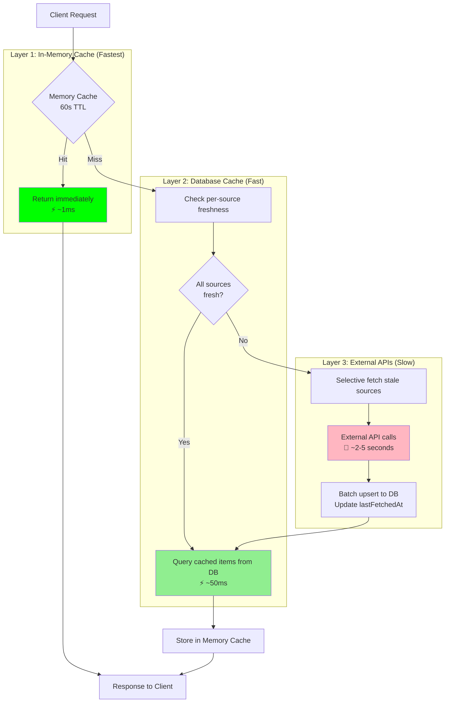
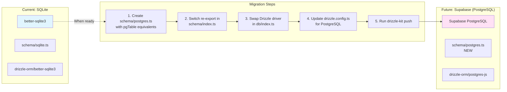

# Caching & Database Architecture

## System Overview

```mermaid
graph TB
    subgraph "Client Layer"
        Client[Client Request]
    end

    subgraph "Memory Cache Layer (60s TTL)"
        MemCache{In-Memory Cache<br/>feedCache}
        MemHit[Cache Hit<br/>Return Immediately]
    end

    subgraph "Source Freshness Layer"
        FreshnessCheck{Check Per-Source<br/>Freshness}
        StaleCheck[Query sources.lastFetchedAt<br/>vs Category TTL]

        subgraph "Category TTLs"
            TTL1[Community: 5min]
            TTL2[Social/News/AI-Labs: 15min]
            TTL3[Newsletters: 30min]
            TTL4[Leaderboards: 60min]
        end
    end

    subgraph "Fetch Decision"
        AllFresh{All Sources<br/>Fresh?}
        SelectiveFetch[Fetch ONLY<br/>Stale Sources]
    end

    subgraph "External APIs"
        API1[Reddit RSS]
        API2[HackerNews API]
        API3[OpenAI Blog RSS]
        API4[GitHub Trending]
        APIMore[+30 more sources...]
    end

    subgraph "Database Layer (SQLite)"
        BatchUpsert[Batch Upsert<br/>chunks of 100<br/>INSERT...ON CONFLICT]
        UpdateTimestamp[Update<br/>sources.lastFetchedAt]
        QueryAll[Query ALL items<br/>from content_items<br/>WHERE sourceId IN (...)]

        DB[(SQLite Database)]

        subgraph "Tables"
            SourcesTable[sources<br/>- id<br/>- enabled<br/>- lastFetchedAt<br/>- priority]
            ContentTable[content_items<br/>- id<br/>- sourceId<br/>- title, url, etc<br/>- publishedAt<br/>- engagement]
            SnapshotsTable[engagement_snapshots<br/>- contentId<br/>- velocityScore<br/>- snapshotAt]
        end
    end

    subgraph "Scoring Layer"
        Score[Score & Sort Items<br/>by Feed Mode]
        FeedModes[Hot: engagement + velocity<br/>Rising: high velocity<br/>Top: total engagement]
    end

    Client --> MemCache
    MemCache -->|Hit| MemHit
    MemCache -->|Miss| FreshnessCheck

    FreshnessCheck --> StaleCheck
    StaleCheck -.-> TTL1
    StaleCheck -.-> TTL2
    StaleCheck -.-> TTL3
    StaleCheck -.-> TTL4

    StaleCheck --> AllFresh
    AllFresh -->|Yes| QueryAll
    AllFresh -->|No| SelectiveFetch

    SelectiveFetch -.->|Parallel Fetch| API1
    SelectiveFetch -.->|Parallel Fetch| API2
    SelectiveFetch -.->|Parallel Fetch| API3
    SelectiveFetch -.->|Parallel Fetch| API4
    SelectiveFetch -.->|Parallel Fetch| APIMore

    API1 --> BatchUpsert
    API2 --> BatchUpsert
    API3 --> BatchUpsert
    API4 --> BatchUpsert
    APIMore --> BatchUpsert

    BatchUpsert --> DB
    BatchUpsert --> UpdateTimestamp
    UpdateTimestamp --> DB

    DB --> SourcesTable
    DB --> ContentTable
    DB --> SnapshotsTable

    BatchUpsert --> QueryAll
    QueryAll --> DB

    QueryAll --> Score
    Score -.-> FeedModes
    Score --> MemCache
    MemCache -.->|Store for 60s| Client

    style MemCache fill:#e1f5ff
    style DB fill:#ffe1e1
    style BatchUpsert fill:#e1ffe1
    style SelectiveFetch fill:#fff4e1
```

## Request Flow (Detailed)



## Cache Key Strategy



## Database Operations: Before vs After



## Category TTL Decision Tree



## Three-Layer Caching Strategy



## Performance Comparison

| Metric | Before | After | Improvement |
|--------|--------|-------|-------------|
| **API Calls on Toggle** | Refetch all 30 sources | Refetch 1 source | **30x fewer** |
| **API Calls on Stale** | Refetch all 30 sources | Refetch ~6-8 stale | **70-80% reduction** |
| **DB Writes (150 items)** | 300 queries (N+1) | 2 queries (batch) | **150x fewer** |
| **Cache Hit Rate** | ~40% (coarse invalidation) | ~85% (granular + memory) | **2x better** |
| **Response Time (cached)** | ~50ms (SQLite) | ~1ms (memory) | **50x faster** |
| **Settings Table** | Polluted with cache keys | Clean | Quality of life ✨ |

## Future Migration Path to Supabase



